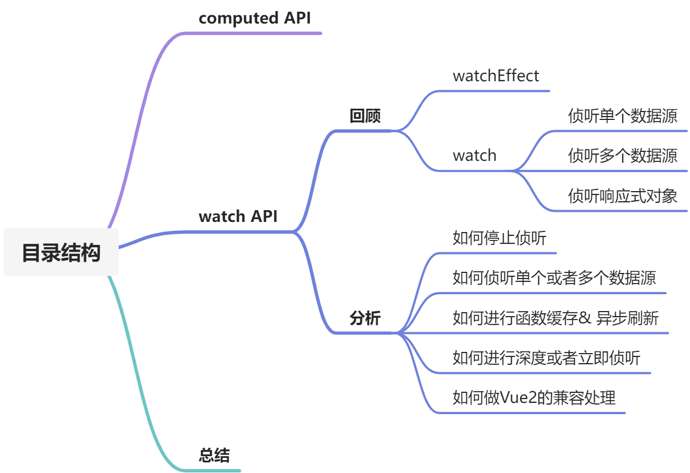

# 第二篇 RunTimeCore——computed & watch源码分析

大家好，我是剑大瑞。

这边文章主要分析Vue3中`watch API`的使用 & 实现原理，希望文中的内容对你有所帮助。

如果有错误之处还望指正。我会非常感谢你的。

如果没有对Vue3的响应式原理不熟悉，建议先阅读第一篇[Vue3 reactivity 源码解析](https://juejin.cn/post/7025420444383576072)。



## `computed` API

在上篇文章中我们分析了`computed`的原理。在`runtime core`中，有对`computed`做了一层处理，主要是记录当前实例的`computed Effect`至`instance.effects`。方便组件卸载的时候，清空依赖。

`runtime core`中的代码较为简单，我们一起简单看下。

- 记录组件创建阶段的 `computed Effect `至` instance.effects`，方便组件卸载的时候，移除当前实例的 `computed effect`
- 我们使用的`computed` API就是经过`runtime core`处理过的`computed`

```typescript
import {
  computed as _computed,
} from '@vue/reactivity'

// 来自component.ts文件
function recordInstanceBoundEffect(effect,instance = currentInstance) {
  if (instance) {
    ;(instance.effects || (instance.effects = [])).push(effect)
  }
}

function computed(getterOrOptions) {
  const c = _computed(getterOrOptions)
  // c.effect
  recordInstanceBoundEffect(c.effect)
  return c
}
```

## `watch` API

Vue3中新增了一个响应式函数：`watchEffect`。在分析`watch & watchEffect`之前，我们一起先回顾下这两个API如何使用。

### 回顾

`watch`与`watchEffect`都属于Vue中的响应式API。

> 注意：一提到响应式，大家就应该想到：`getter & track`、`setter & trigger`。

#### `watchEffect`

- `watchEffect`可以根据响应数据状态的变化，自动或者重新执行传入的副作用函数。

- 他接受一个回调函数，并在创建的时候立即执行，[同时对齐进行响应式依赖追踪](https://juejin.cn/post/7025420444383576072)。
- 即建立当前传入的回调函数与所有相关`effect`的依赖关系。
- 并在依赖变化的时候重新运行该回调函数。
- 并会返回一个`stop`函数，用来停止侦听，即断开当前`watchEffect`与其所有依赖的`effect`之间的关系

```js
const count = ref(0)

const stop = watchEffect(() => console.log(count.value))
// -> logs 0

setTimeout(() => {
  count.value++
  // -> logs 1
}, 100)

// 停止侦听
stop()
count.value += 1
```

当然`watchEffect`也可以接受异步回调函数作为参数。当回调函数为异步时：

- `watchEffect`可以给传入的函数传递一个异步的`onInvalidate`函数作为入参，用来注册清理`watchEffect`失效时的回调函数
- 何时`watchEffect`会失效：
  - 当手动调用`stop`函数的时候
  - 当组件卸载的时候

```js

const stop = watchEffect(onInvalidate => {
  const token = performAsyncOperation(id.value)
  onInvalidate(() => {
    // 当调用stop函数时，会执行给onInvalidate传入的回调函数
    token.cancel()
  })
})
onUnmounted(() => {
    console.log('组件卸载')
})
```

为了提高刷新效率，Vue的响应式系统会缓存并异步处理所有`watchEffect`副作用函数，以避免同一个“`tick`” 中多个状态改变导致的不必要的重复调用。

> 关于如何缓存并异步处理，稍后源码中进行解析

配置`watchEffect`，`watchEffect`可以接受两个参数，第二个参数对`watchEffect`进行配置：

- 默认情况下`（flush: 'pre'）`，`watchEffec`t副作用会在所有的组件 `update` **前**执行
- 当设置`flush: 'post'`时，组件更新后会重新运行`watchEffect`副作用
- 当设置`flush: 'sync'`时，这将强制效果始终同步触发`watchEffect`副作用

```vue
<template>
  <div>{{ count }}</div>
</template>

<script>
export default {
  setup() {
    const count = ref(0)
    // 更新前触发
    watchEffect(() => {
      console.log(count.value)
    }, {
    	flush: 'pre'
  	})
	// 更新后触发
    watchEffect(() => {
      console.log(count.value)
    }, {
    	flush: 'post'
  	})
    // 同步触发
	watchEffect(() => {
      console.log(count.value)
    }, {
    	flush: 'sync'
  	})
    return {
      count
    }
  }
}
</script>
```

#### `watch`

- `watch`等同于组件侦听器`property`
- 需要侦听特定的响应式数据源
- 并在回调喊胡世宗执行副作用
- 默认情况下是惰性的，只有当侦听的数据源发生变化的时候才会执行回调

##### 侦听单个数据源：

```js
// 侦听一个 getter
const state = reactive({ count: 0 })
watch(
  () => state.count,
  (count, prevCount) => {
    /* ... */
  }
)

// 直接侦听ref
const count = ref(0)
watch(count, (count, prevCount) => {
  /* ... */
})
```

##### 侦听多个数据源（直接侦听`ref`）：

> 注意虽然侦听的是多个数据源，但是当多个数据源发生改变的时候，侦听器仍只会执行一次

```js
setup() {
  const firstName = ref('')
  const lastName = ref('')

  watch([firstName, lastName], (newValues, prevValues) => {
    console.log(newValues, prevValues)
  })

  const changeValues = () => {
    firstName.value = 'John'
    lastName.value = 'Smith'
    // 打印 ["John", "Smith"] ["", ""]
  }

  return { changeValues }
}
```

##### 侦听响应式对象

- `deep`可进行深度侦听
- `immediate`可进行立即侦听

```js
const state = reactive({ 
  id: 1,
  attributes: { 
    name: '',
  }
})

watch(
  () => state,
  (state, prevState) => {
    console.log('not deep', state.attributes.name, prevState.attributes.name)
  }
)
// 深度并立即响应侦听
watch(
  () => state,
  (state, prevState) => {
    console.log('deep', state.attributes.name, prevState.attributes.name)
  },
  { deep: true, immediate: true }
)

state.attributes.name = 'Alex' // 日志: "deep" "Alex" "Alex"
```

> 这里需要说下 【副作用】、【依赖】都是我们上一篇文章中提到的`effet`。
>
> 比较关键的是，我们这里接触的是Vue源码中的第二个级别的`effect`，第一个是`compute Effect`。这次要说的是`watch Effect`。

Ok，到这里我们基本已经回顾完这两个响应式API如何使用了，下面我们结合源码，进行分析。

### 分析

通过回顾部分的内容，基本已经对`watch & watchEffect`有了点感觉，既然要分析源码实现，最好是带着问题来看：

1. `watchEffect`是如何停止侦听的？
2. `watchEffect`是如何进行函数缓存的?
3. `watchEffect`是如何异步进行刷新的？
4. `watch`是如何侦听单个或者多个数据源的？
5. `watch`是如何进行深度或者立即侦听响应的？

Vue3中的`watch`代码中设计的功能比较多，为了方便理解，我们拆开来一点一点进行解析

#### `watchEffect`是如何停止侦听的？

前面提到`watch`其实也是一个`effect`，所谓的侦听就是watch与其他`effect`之间建立一个依赖关系，当数据发生变化的时候，去遍历执行所有的`effect`，就会执行`watch`。

在上一篇文章中我们提到，`effect`中有个`stop`函数，用于断开传入`effect`与之相关的依赖之间的关系。

所谓的停止侦听就是断开`watch`与所有相关`effect`的依赖关系。

当创建`watch Effect`时，会为其维护一个`deps`属性，用于存储所有的`dep`。故当我们创建`watch`的时候，将当前`runner`传给`stop`函数，并返回一个函数，用户调用的时候，就会停止侦听。

下面代码我们暂时省略与停止侦听无关的代码，只需理解能解答问题的部分即可。

```js
// reactive effect.ts 文件
export function stop(effect) {
  if (effect.active) {
    cleanup(effect)
    if (effect.options.onStop) {
      effect.options.onStop()
    }
    effect.active = false
  }
}
function cleanup(effect) {
  const { deps } = effect
  if (deps.length) {
    for (let i = 0; i < deps.length; i++) {
      deps[i].delete(effect)
    }
    deps.length = 0
  }
}

// 真正的watch函数
function doWatch(
  source,
  cb,
  { immediate, deep, flush, onTrack, onTrigger } = EMPTY_OBJ,
  instance 
) {
  // 定义runner
  // watch 级别的effect
  // runner执行，即执行getter函数
  const runner = effect(getter, {
    lazy: true,
    onTrack,
    onTrigger,
    scheduler
  })

  
  // 返回一个stop函数
  // 用于断开runner与其他依赖之间的关系
  // 并将其将从instance.effects中移除
  return () => {
    stop(runner)
    // 
    if (instance) {
      remove(instance.effects!, runner)
    }
  }
}
```

`runner`就是`effect API`创建的`watch Effect`。`watch`对数据源进行侦听的时候，就会与其他依赖之间建立关系。即`effect`与`dep`之间相互耦合的关系。

当需要停止侦听的时候，通过调用`doWatch`返回的函数就可以断开`runner`与其他`dep`的依赖关系。

#### `watch`是如何侦听单个或者多个数据源的？

在回顾部分我们知道，`watch`可以进行多种数据响应式数据类型的监听。

当`watch`侦听的数据源发生变化的时候就会执行`callback`。这就是前面我们说的响应式。

在使用`watch`时，`doWatch`会创建一个 `getter`函数，用于确定数据源与`callback`之间的关系。

`getter`函数用于获取数据源的更新后的值。当`getter`函数执行的时候，就会触发依赖收集。

所以Vue3是在`getter`函数中对数据源进行判断侦听的。下面我们先看下源码的`getter`部分，在继续分析。

```js
function doWatch(
  source,
  cb,
  { immediate, deep, flush, onTrack, onTrigger } = EMPTY_OBJ,
  instance = currentInstance
) {
  /**
  *  省略部分代码...
  */ 
      
  let getter
  let forceTrigger = false
  let isMultiSource = false
  
  /* Start: 开始定义getter函数 */
  if (isRef(source)) {
      
    // 👉👉👉第一种情况： 
    // 源是ref类型
    getter = () => source.value
    forceTrigger = !!source._shallow
  } else if (isReactive(source)) {
      
    // 👉👉👉第二种情况： 
    // 源是响应式对象，响应式对象自动进行深度侦听
    getter = () => source
    deep = true
  } else if (isArray(source)) {
      
    // 👉👉👉第三种情况： 
    // 侦听多个源
    isMultiSource = true
    forceTrigger = source.some(isReactive)
    getter = () =>
      // 遍历判断源
      source.map(s => {
        if (isRef(s)) {
          return s.value
        } else if (isReactive(s)) {
          // 递归返回值
          return traverse(s)
        } else if (isFunction(s)) {
          // 执行函数
          return callWithErrorHandling(s, instance, ErrorCodes.WATCH_GETTER)
        } else {
          // 已上都不是 则进行警示
          __DEV__ && warnInvalidSource(s)
        }
      })
  } else if (isFunction(source)) {
      
    // 👉👉👉第四种情况：  
    // 数据源是函数
    if (cb) {
      // getter with cb
      getter = () =>
        callWithErrorHandling(source, instance, ErrorCodes.WATCH_GETTER)
    } else {
      
      // 👉👉👉分支情况：  
      // no cb -> simple effect
      // 没有传回调函数的情况
      getter = () => {
        if (instance && instance.isUnmounted) {
          return
        }
        if (cleanup) {
          cleanup()
        }
        return callWithAsyncErrorHandling(
          source,
          instance,
          ErrorCodes.WATCH_CALLBACK,
          [onInvalidate]
        )
      }
    }
  } else {
    // 数据源可能有问题 进行校验 提示
    getter = NOOP
    __DEV__ && warnInvalidSource(source)
  }
  /* End: 定义getter函数结束 */

  /**
  *  省略部分代码...
  */ 
}
```

从上面的代码我们可以看出，`doWatch`内部共对数据源进行了四种情况的判断。

- 并且当数据源是响应式数据类型时，会自动进行深度侦听
- 当侦听的是多个数据源的时候，会进行递归遍历

- 当数据源是函数的时候，`getter`函数最终会调用 `callWithAsyncErrorHandling`异步执行侦听的函数。
- 当`deep`为t`true`时，会对`getter`进行递归遍历。

再结合上面分析停止侦听的代码，可以知道，当`runner`函数执行的时候，就是执行`getter`获取数据源新值的时候。

深度侦听函数：

- 是一个深度递归遍历函数
- 通过seen函数判断循环引用的情况
- 最终返回的是原始类型数据

```js
// 👉👉👉 递归遍历获取值，seen用于防止陷入死循环
function traverse(value, seen = new Set()) {
  if (
    !isObject(value) ||
    seen.has(value) ||
    (value)[ReactiveFlags.SKIP]
  ) {
    return value
  }
    
  seen.add(value)
    
  if (isRef(value)) {
    traverse(value.value, seen)
  } else if (isArray(value)) {
    for (let i = 0; i < value.length; i++) {
      traverse(value[i], seen)
    }
  } else if (isSet(value) || isMap(value)) {
    value.forEach((v: any) => {
      traverse(v, seen)
    })
  } else if (isPlainObject(value)) {
    for (const key in value) {
      traverse((value)[key], seen)
    }
  }
  return value
}
```


#### watchEffect是如何进行函数缓存 & 异步进行刷新的?

我们知道当使用`effect`函数创建`runner`的时候，其实是创建了一个`watch Effect`。

> 这里回顾下，在`computed`中，Vue3是直接将`effect`返回的函数，赋给`ComputedRefImpl`实例的`effect`属性，并在实例的`getter`函数中调用this.effect，从而获取 value。

在使用`watch`的时候，我们并没有直接或间接使用`effect`函数返回的watch Effect函数获取新值。也没有必要这么使用。

但是我们需要在相关依赖发生变化的时候重新执行`watch Effect`获取新值 & 执行`callback`。那该如何做？

答案是通过给`watch Effect` 配置**`scheduler`**属性。

当进行响应派发的时候，会触发`trigger`函数，`trigger`函数最终会遍历执行所有相关`effect`。

在执行`effect`的过程中会判断`effect.scheduler`是否存在，如果存在就会执行`scheduler`函数。

而`watch Effect`就是在`scheduler`中做的副作用函数的缓存和异步刷新的。

还是原来的套路，让我们先看下`scheduler`源码部分：

```js
// 真正的watch函数
function doWatch(
  source,
  cb,
  { immediate, deep, flush, onTrack, onTrigger } = EMPTY_OBJ,
  instance = currentInstance
) {

  /**
  *  省略部分代码...
  */ 

  // 调度器，有没有想到computed API 创建的时候，在配置项中设置的 scheduler
  // 在computed中scheduler主要负责重置 dirty
  // 当 watche Effect 侦测的数据源发生变化的时候
  // 会进行trigger，遍历执行所有与数据源相关的 effect
  // 在遍历的过程中会判断effect.scheduler 是否存在
  // 如果存在 则会执行scheduler（任务调度器），这一点与我们第一篇提到的computed的原理一样
  // scheduler执行 其实就是在执行job，job执行就是在执行 runner Effect
  // 即 watch Effect
  let scheduler
  if (flush === 'sync') {
    // 同步更新
    scheduler = job // 任务调度函数被直接调用
  } else if (flush === 'post') {
    // 组件更新后
    scheduler = () => queuePostRenderEffect(job, instance && instance.suspense)
  } else {
    // 🚩🚩🚩默认情况下
    // 🚩🚩🚩通过queuePreFlushCb缓存job，并异步更新副作用函数
    scheduler = () => {
      if (!instance || instance.isMounted) {
        queuePreFlushCb(job)
      } else {
        // 使用 'pre' 选项，第一次调用必须在组件安装之前发生，以便同步调用。
        job()
      }
    }
  }
  // 创建watch Effect
  const runner = effect(getter, {
    lazy: true,
    onTrack,
    onTrigger,
    scheduler
  })
  /**
  *  省略部分代码...
  */ 
}
```

通过上面的代码，我们简单分析`scheduler`的创建过程：

- 主要与创建`watch`时配置的flush有关
- 在默认下情况下`scheduler`内部通过`queuePreFlushCb`将job缓存在待执行队列中，并通过`Promise.resolve`异步更新队列从而避免不必要的重复调用
- 通过`Promise`创建微任务。在`update`之前执行所有的副作用函数，等于是提高了副作用函数的优先级

>这里我们先知道`watchEffect`是通过`queuePreFlushCb`做到的副作用函数缓存 & 异步批量更新。在后续的文章中会分析`scheduler.ts`部分的内容。到时候就会明白其作用。
>
>另：基础薄弱的同学，建议熟悉下浏览器的宏任务与微任务相关知识。

在上面的代码中，可以知道`scheduler`主要的职责就是根据情况对`job`进行处理，那`job`是什么？

`job` 就是异步队列中的一个个任务。主要负责：

- 通过判断`callback`，对`watch` 与 `watchEffect`进行判断
- 通过执行`runner`获取新值
- 通过`callWithAsyncErrorHandling`对callback函数进行异步处理，并将新旧值传给`callback`，这也是我们为什么可以在`watch`中拿到侦听数据源，变化前后value的原因。

下面一起看下`job`部分的代码实现：

```js
// Simple effect.
// watchEffect 的创建方式
function watchEffect(
  effect,
  options
) {
  return doWatch(effect, null, options)
}

// watch 的创建方式
function watch (source, cb, options) {
  if (__DEV__ && !isFunction(cb)) {
    warn(
      `\`watch(fn, options?)\` signature has been moved to a separate API. ` +
        `Use \`watchEffect(fn, options?)\` instead. \`watch\` now only ` +
        `supports \`watch(source, cb, options?) signature.`
    )
  }
  return doWatch(source, cb, options)
}
// 真正的watch函数
function doWatch(
  source,
  cb,
  { immediate, deep, flush, onTrack, onTrigger } = EMPTY_OBJ,
  instance = currentInstance
) {

  /**
  *  省略部分代码...
  */ 
      
  let cleanup 

  // 定义失效时需要传参的函数
  let onInvalidate = (fn) => {
    // 用于执行用户传进来的fn函数
    cleanup = runner.options.onStop = () => {
      callWithErrorHandling(fn, instance, ErrorCodes.WATCH_CLEANUP)
    }
  }
  let oldValue = isMultiSource ? [] : INITIAL_WATCHER_VALUE

  // 定义任务队列中的任务
  // 用于执行runner函数
  // 执行的过程会进行track & trigger
  const job = () => {
    if (!runner.active) {
      return
    }
    if (cb) {
      // 🚩🚩🚩watch(source, cb)
      // runner执行就是在执行getter函数，获取newValue
      const newValue = runner()
      if (
        deep ||
        forceTrigger ||
        (isMultiSource
          ? (newValue).some((v, i) =>
              hasChanged(v, (oldValue)[i])
            )
          : hasChanged(newValue, oldValue)) ||
        (__COMPAT__ &&
          isArray(newValue) &&
          isCompatEnabled(DeprecationTypes.WATCH_ARRAY, instance))
      ) {
          
        if (cleanup) {
          cleanup()
        }
          
        // 执行回调函数
        // 因为我们在传入的cb中很有可能读取或者更改响应式数据
        // 因此可能会进行 track || trigger
        // 将newValue & oldValue传给cb
        callWithAsyncErrorHandling(cb, instance, ErrorCodes.WATCH_CALLBACK, [
          newValue, 
          oldValue === INITIAL_WATCHER_VALUE ? undefined : oldValue,
          onInvalidate
        ])
        // 将新值赋值给旧值
        oldValue = newValue
      }
    } else {
        
      // 🚩🚩🚩watchEffect(effect)
      // watchEffect
      // watchEffect API的处理方式，直接执行runner
      runner()
    }
  }

  // 将job标记为一个可以侦测的回调函数，以便调度器知道他可以自动进行响应触发（trigger）
  job.allowRecurse = !!cb

  /**
  *  省略部分代码...
  */ 
}
```

通过上面代码，可以知道：

- 对于`watchEffect`，执行`job`，就是在直接执行`runner`函数

- 对于`watch`，首先需要通过`runner`获取新的`value`，并将新旧值传给`callback`函数。

#### watch是如何进行深度或者立即侦听响应的？

这里就很简单了，直接上代码：

深度侦听就是去遍历递归原来的`getter`函数

立即侦听即直接执行`job`函数，触发`runner`，并执行`callback`。

```js
// 真正的watch函数
function doWatch(
  source,
  cb,
  { immediate, deep, flush, onTrack, onTrigger } = EMPTY_OBJ,
  instance = currentInstance
) {
  /**
  *  省略部分代码...
  */ 
  // 👉深度侦听
  if (cb && deep) {
    // 深度侦听，则递归遍历getter函数返回的值
    const baseGetter = getter
    getter = () => traverse(baseGetter())
  }

 /**
  *  省略部分代码...
  */ 

  // initial run
  if (cb) {
     // 👉立即响应侦听
    if (immediate) {
      // 立即执行
      // 即进行track & trigger
      job()
    } else {
      oldValue = runner()
    }
  } else if (flush === 'post') {
    queuePostRenderEffect(runner, instance && instance.suspense)
  } else {
    runner()
  }
 
 /**
  *  省略部分代码...
  */ 
}

```

#### 如何做Vue2的兼容处理

Vue3在`doWatch`函数中，还做了一层Vue2的兼容处理，主要是通过对`getter`函数进行了一层重载，并对`getter`函数返回的`value`进行了深度递归遍历。

```js
// 真正的watch函数
function doWatch(
  source,
  cb,
  { immediate, deep, flush, onTrack, onTrigger } = EMPTY_OBJ,
  instance = currentInstance
) {
  
  /**
  *  省略部分代码...
  */ 
 
  // 2.x array mutation watch compat
  // Vue2做兼容处理
  if (__COMPAT__ && cb && !deep) {
    const baseGetter = getter
    getter = () => {
      const val = baseGetter()
      if (
        isArray(val) &&
        checkCompatEnabled(DeprecationTypes.WATCH_ARRAY, instance)
      ) {
        traverse(val)
      }
      return val
    }
  }
  
 /**
  *  省略部分代码...
  */ 
}
```

## 总结

- 通过上面的分析，我们现在掌握了两个源码级别的`Effect`，一个是`computed Effect`，一个是`watch Effect`。
- `watch`能对数据源进行响应式侦听。主要是通过将数据源转化为`getter`函数。
- 并通过`effect`建立`watch Effect`与相关依赖之间的关系。
- 当数据源发生变化的时候，会触发`Trigger`，进行响应派发，遍历执行所有相关的`effect`。
- 当`effect.scheduler`存在时，就会执行`scheduler`函数，而`watch`内部通过`scheduler`，对`job`任务进行了缓存，并放在一个待执行队列中，在`update`前，会通过`promise`异步执行`job`任务。
- `job`执行，就会获取数据源变化后的值，并将新旧`value`传给用户创建`watch`时的回调函数。完成侦听任务。

> 不要忘记，在job中获取新值也会触发`Track`任务。

.png)


最后让我们看下完整的`watch`相关部分的代码：

```typescript
// 👉👉👉 watcheffect.
export function watchEffect(
  effect: WatchEffect,
  options?: WatchOptionsBase
): WatchStopHandle {
  return doWatch(effect, null, options)
}
// 👉👉👉 进行重载，侦听多个数据源 & cb
export function watch<
  T extends MultiWatchSources,
  Immediate extends Readonly<boolean> = false
>(
  sources: [...T],
  cb: WatchCallback<MapSources<T, false>, MapSources<T, Immediate>>,
  options?: WatchOptions<Immediate>
): WatchStopHandle

// 👉👉👉 重载：侦听多个数据源，并且数据源是只读的
export function watch<
  T extends Readonly<MultiWatchSources>,
  Immediate extends Readonly<boolean> = false
>(
  source: T,
  cb: WatchCallback<MapSources<T, false>, MapSources<T, Immediate>>,
  options?: WatchOptions<Immediate>
): WatchStopHandle

// 👉👉👉 重载：简单watch Effect & cb
export function watch<T, Immediate extends Readonly<boolean> = false>(
  source: WatchSource<T>,
  cb: WatchCallback<T, Immediate extends true ? (T | undefined) : T>,
  options?: WatchOptions<Immediate>
): WatchStopHandle

// 👉👉👉 重载：侦听响应式对象 & cb
export function watch<
  T extends object,
  Immediate extends Readonly<boolean> = false
>(
  source: T,
  cb: WatchCallback<T, Immediate extends true ? (T | undefined) : T>,
  options?: WatchOptions<Immediate>
): WatchStopHandle

// 👉👉👉 执行创建 watch
export function watch<T = any, Immediate extends Readonly<boolean> = false>(
  source: T | WatchSource<T>,
  cb: any,
  options?: WatchOptions<Immediate>
): WatchStopHandle {
  if (__DEV__ && !isFunction(cb)) {
     // 省略...
  }
  // 返回的是一个stop函数
  return doWatch(source as any, cb, options)
}
// 👉👉👉真正的watch函数
function doWatch(
  source: WatchSource | WatchSource[] | WatchEffect | object,
  cb: WatchCallback | null,
  { immediate, deep, flush, onTrack, onTrigger }: WatchOptions = EMPTY_OBJ,
  instance = currentInstance
): WatchStopHandle {
  // 👉👉👉 dev环境下判断 immediate, deep
  if (__DEV__ && !cb) {
    if (immediate !== undefined) {
      warn(
        `watch() "immediate" option is only respected when using the ` +
          `watch(source, callback, options?) signature.`
      )
    }
    if (deep !== undefined) {
      warn(
        `watch() "deep" option is only respected when using the ` +
          `watch(source, callback, options?) signature.`
      )
    }
  }
  // 👉👉👉 校验数据源
  const warnInvalidSource = (s: unknown) => {
    warn(
      `Invalid watch source: `,
      s,
      `A watch source can only be a getter/effect function, a ref, ` +
        `a reactive object, or an array of these types.`
    )
  }

  let getter: () => any
  let forceTrigger = false
  let isMultiSource = false
  
  /* Start: 开始定义getter函数 */
  if (isRef(source)) {
    // 源是ref类型
    getter = () => source.value
    forceTrigger = !!source._shallow
  } else if (isReactive(source)) {
      
    // 👉👉👉 源是响应式对象，自动进行深度侦听
    getter = () => source
    deep = true
  } else if (isArray(source)) {
      
    // 👉👉👉 侦听多个源，遍历递归侦听
    isMultiSource = true
    forceTrigger = source.some(isReactive)
    getter = () =>
      // 遍历判断源
      source.map(s => {
        if (isRef(s)) {
          return s.value
        } else if (isReactive(s)) {
          // 递归返回值
          return traverse(s)
        } else if (isFunction(s)) {
          // 执行函数
          return callWithErrorHandling(s, instance, ErrorCodes.WATCH_GETTER)
        } else {
          // 已上都不是 则进行警示
          __DEV__ && warnInvalidSource(s)
        }
      })
  } else if (isFunction(source)) {
    // 👉👉👉 数据源是函数
    if (cb) {
      // getter with cb
      getter = () =>
        callWithErrorHandling(source, instance, ErrorCodes.WATCH_GETTER)
    } else {
      // no cb -> simple effect
      // 没有传回调函数的情况，watchEffect
      getter = () => {
        if (instance && instance.isUnmounted) {
          return
        }
        if (cleanup) {
          cleanup()
        }
        return callWithAsyncErrorHandling(
          source,
          instance,
          ErrorCodes.WATCH_CALLBACK,
          [onInvalidate]
        )
      }
    }
  } else {
    getter = NOOP
    __DEV__ && warnInvalidSource(source)
  }
  /* End: 定义getter函数结束 */

  // 👉👉👉 Vue2做兼容处理
  if (__COMPAT__ && cb && !deep) {
    const baseGetter = getter
    getter = () => {
      const val = baseGetter()
      if (
        isArray(val) &&
        checkCompatEnabled(DeprecationTypes.WATCH_ARRAY, instance)
      ) {
        traverse(val)
      }
      return val
    }
  }

  if (cb && deep) {
    // 深度侦听，则递归遍历getter函数返回的值
    const baseGetter = getter
    getter = () => traverse(baseGetter())
  }

  let cleanup: () => void

  // 👉👉👉 定义失效时需要传参的函数
  let onInvalidate: InvalidateCbRegistrator = (fn: () => void) => {
    cleanup = runner.options.onStop = () => {
      callWithErrorHandling(fn, instance, ErrorCodes.WATCH_CLEANUP)
    }
  }

  // 👉👉👉 服务端渲染的情况下，不必创建一个真正的effect， onInvalidate 应该为一个空对象，
  // 触发 immediate 为true
  if (__NODE_JS__ && isInSSRComponentSetup) {
    // we will also not call the invalidate callback (+ runner is not set up)
    onInvalidate = NOOP
    if (!cb) {
      getter()
    } else if (immediate) {
      callWithAsyncErrorHandling(cb, instance, ErrorCodes.WATCH_CALLBACK, [
        getter(),
        undefined,
        onInvalidate
      ])
    }
    return NOOP
  }

  let oldValue = isMultiSource ? [] : INITIAL_WATCHER_VALUE

  // 👉👉👉 定义任务队列中的任务，用于执行runner函数，执行的过程会进行track & trigger
  const job: SchedulerJob = () => {
    if (!runner.active) {
      return
    }
    if (cb) {
      // watch(source, cb)
      // runner执行就是在执行getter函数，获取newValue
      const newValue = runner()
      if (
        deep ||
        forceTrigger ||
        (isMultiSource
          ? (newValue as any[]).some((v, i) =>
              hasChanged(v, (oldValue as any[])[i])
            )
          : hasChanged(newValue, oldValue)) ||
        (__COMPAT__ &&
          isArray(newValue) &&
          isCompatEnabled(DeprecationTypes.WATCH_ARRAY, instance))
      ) {
        // watch API的处理方式
        // cleanup before running cb again
        if (cleanup) {
          cleanup()
        }
        // 执行回调函数
        // 因为我们在传入的cb中很有可能读取或者更改响应式数据
        // 因此可能会进行 track || trigger
        // 将newValue & oldValue传给cb
        callWithAsyncErrorHandling(cb, instance, ErrorCodes.WATCH_CALLBACK, [
          newValue, 
          oldValue === INITIAL_WATCHER_VALUE ? undefined : oldValue,
          onInvalidate
        ])
        // 将新值赋值给旧值
        oldValue = newValue
      }
    } else {
      // watchEffect
      // watchEffect API的处理方式，直接执行runner
      runner()
    }
  }

  // 👉👉👉 将job标记为一个可以侦测的回调函数，以便调度器知道他可以自动进行响应触发（trigger）
  job.allowRecurse = !!cb
      
  // 👉👉👉
  // 调度器，有没有想到computed API 创建的时候，在配置项中设置的 scheduler
  // 在computed中scheduler主要负责重置 dirty
  // 当 watche Effect 侦测的数据源发生变化的时候
  // 会进行trigger，遍历执行所有与数据源相关的 effect
  // 在遍历的过程中会判断effect.scheduler 是否存在
  // 如果存在 则会执行scheduler（任务调度器），这一点与我们第一篇提到的computed的原理一样
  // scheduler执行 其实就是在执行job，job执行就是在执行 runner Effect
  // 即watch Effect
  let scheduler: ReactiveEffectOptions['scheduler']
  if (flush === 'sync') {
    // 同步更新
    scheduler = job as any // 任务调度函数被直接调用
  } else if (flush === 'post') {
    // 组件更新后
    scheduler = () => queuePostRenderEffect(job, instance && instance.suspense)
  } else {
    // default: 'pre'
    // 默认情况下
    scheduler = () => {
      if (!instance || instance.isMounted) {
        queuePreFlushCb(job)
      } else {
        // 使用 'pre' 选项，第一次调用必须在组件安装之前发生，以便同步调用。
        job()
      }
    }
  }

  // 👉👉👉 定义runner， watch 级别的effect，runner执行，即执行getter函数
  const runner = effect(getter, {
    lazy: true,
    onTrack,
    onTrigger,
    scheduler
  })
  
  // 👉👉👉将watch effect 存至instance.effects，当组件卸载的时候会清空当前runner与依赖之间的关系
  recordInstanceBoundEffect(runner, instance)

  // 👉👉👉initial run
  if (cb) {
    if (immediate) {
      // 👉👉👉立即执行，即进行track & trigger
      job()
    } else {
      oldValue = runner()
    }
  } else if (flush === 'post') {
    queuePostRenderEffect(runner, instance && instance.suspense)
  } else {
    runner()
  }

  // 👉👉👉返回一个stop函数，用于断开runner与其他依赖之间的关系，并将其将从instance.effects中移除
  return () => {
    stop(runner)
    // 
    if (instance) {
      remove(instance.effects!, runner)
    }
  }
}

// 👉👉👉 this.$watch，组件实例上的watch API
export function instanceWatch(
  this: ComponentInternalInstance,
  source: string | Function,
  value: WatchCallback | ObjectWatchOptionItem,
  options?: WatchOptions
): WatchStopHandle {
  const publicThis = this.proxy as any
  // 👉👉👉 定义getter函数
  const getter = isString(source)
    ? source.includes('.')
      ? createPathGetter(publicThis, source)
      : () => publicThis[source]
    : source.bind(publicThis, publicThis)
  let cb
  if (isFunction(value)) {
    cb = value
  } else {
    cb = value.handler as Function
    options = value
  }
  return doWatch(getter, cb.bind(publicThis), options, this)
}

// 👉👉👉 获取侦听路径
export function createPathGetter(ctx: any, path: string) {
  const segments = path.split('.')
  return () => {
    let cur = ctx
    for (let i = 0; i < segments.length && cur; i++) {
      cur = cur[segments[i]]
    }
    return cur
  }
}

// 👉👉👉 递归遍历获取值，seen用于防止陷入死循环
function traverse(value: unknown, seen: Set<unknown> = new Set()) {
  if (
    !isObject(value) ||
    seen.has(value) ||
    (value as any)[ReactiveFlags.SKIP]
  ) {
    return value
  }
  seen.add(value)
  if (isRef(value)) {
    traverse(value.value, seen)
  } else if (isArray(value)) {
    for (let i = 0; i < value.length; i++) {
      traverse(value[i], seen)
    }
  } else if (isSet(value) || isMap(value)) {
    value.forEach((v: any) => {
      traverse(v, seen)
    })
  } else if (isPlainObject(value)) {
    for (const key in value) {
      traverse((value as any)[key], seen)
    }
  }
  return value
}

```

> 如果文章中有错误之处，还望大佬们批评指正。
>
> 如果喜欢我的文章，可以关注 + 点赞。
>
> 如果需要持续了解Vue3源码分析系列，可关注我公共号【coder狂想曲】。在这里我们一起精进！年年double！
>
> 感谢阅读。

参考：

- [Vue官网](https://v3.cn.vuejs.org/guide/reactivity-computed-watchers.html#%E5%81%9C%E6%AD%A2%E4%BE%A6%E5%90%AC)
- [Vue-next](https://github.com/vuejs/vue-next)

