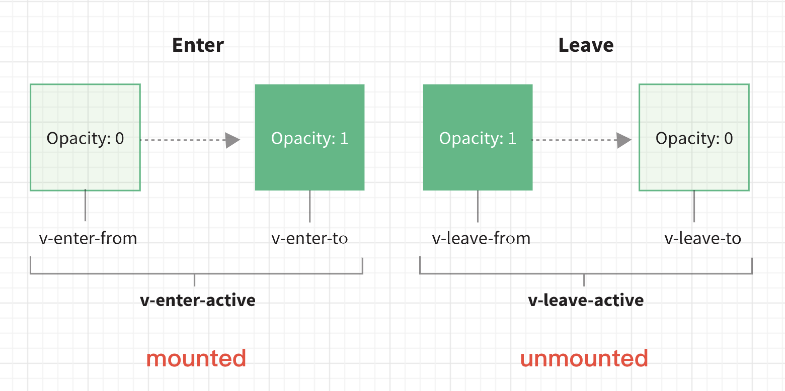

# 手摸手实现Transition

`xdm`好，我是剑大瑞。

本篇内容旨在通过自己实现`Transition`组件，从而了解其内部原理。

> 如果你还没有使用过`Transition`组件或者对其不熟悉，那么我建议你可以先学习官方文档，写一些demo，当熟悉了`Transition`组件之后，但是又对其原理有所好奇，就可以再回来学习这篇文章。官方文档👉[传送门](https://v3.cn.vuejs.org/guide/transitions-overview.html)。
> 

## 前言

通过官方文档可以知道，当使用`Transition`组件的时候，我们可以通过配置`Transition`组件的`props`控制组件的进场过渡、离场过渡状态、动画效果。

配置`props`的过程中，重要的是指定`name`。`Vue`会将`name`字段与不同的过渡阶段名称进行组合，在不同的阶段为我们的`dom`添加类名或者移除类名。

这里借用官网的示意图：


这张图片对于`Transition`组件的过渡效果描述非常确切了：

- 当组件挂载的时候，`class`由`v-enter-from`过渡为`v-enter-to`。切换的中间过程我们称它为`v-enter-active`。
- 当组件卸载的时候，`class`由`v-leave-from`过渡为`v-leave-to`。切换的过程我们称它为`v-leave-active`。
- 在由`enter-from⇒enter-to`或者`leave-from⇒leave-to`的阶段，我们可以指定组件的初始和最终样式。在`enter-active` & `leave-active`阶段我们可以指定组件的过渡或者动画效果。

首先我们需要调用`defineComponent` API来定义一个`MyTransition`组件，通过`setup`获取插槽中的内容。

这里面有两点需要考虑：

1. `MyTransition`只会把过渡效果应用到其包裹的内容上，而不会额外渲染 `DOM` 元素，也不会出现在可被检查的组件层级中。
   
    **就是说组件并不需要有自己的`template`，只做插槽的搬用工。**
    
2. `MyTransition`组件并不需要有自己的状态，只需将用户传入的`props`处理后，再将处理后的`newProps`传给子组件即可。
   
     **就是说`MyTransition`组件并不需要有自己的状态，只做状态的搬运工。**


## `Props`设计

但是我们怎么设计`props`呢？

考虑这个问题，还需要回到`Transition`组件的核心逻辑在于：

- 在组件的挂载阶段，我们需要将`enter-from`至`enter-to`阶段的过渡或者动画效果`class`附加到`DOM`元素上。
- 在组件的卸载卸载，我们需要将`leave-from`至`leave-to`阶段的过渡或者动画效果`class`附加到`DOM`元素上。



那我们是否需要通过`mounted`、`unmounted` API钩子中实现`class`的移除和添加呢？

答案是：其实不需要。在`Vue` 中的`Transition`组件是与渲染器的`patch`逻辑高度依赖的。

### 渲染器处理方式

在渲染器中，可以在*`mountElement`函数中，处理`Enter`阶段的过渡或者动画效果。在`remove`函数中处理`Leave`阶段的过渡或者动画效果。*

这里我们在此简单看下这两个函数的代码：

- `mountElement`函数简略版，`mountElement`函数负责挂载元素。

```jsx
// 挂载元素节点
const mountElement = (vnode,...args) => {
  let el;
  let vnodeHook;
  const { type, props, shapeFlag, transition, patchFlag, dirs } = vnode;
  // 省略部分代码...
  *if (needCallTransitionHooks*) {
			// 执行过渡钩子
      transition.beforeEnter(el);
  }
  // 省略部分代码...
  if ((vnodeHook = props && props.onVnodeMounted) ||
      needCallTransitionHooks ||
      dirs) {
      // post 各种钩子 至后置执行任务池
      queuePostRenderEffect(() => { 
        // 执行过渡动画钩子
        needCallTransitionHooks && transition.enter(el); 
      }, parentSuspense);
  }
};
```

- `remove`函数简略版，`remove`函数主要负责从父元素中移除元素。

```jsx
// 移除Vnode
const remove = vnode => {
  const { type, el, anchor, transition } = vnode;
  // 省略部分代码...

  const performRemove = () => {
      hostRemove(el);
      if (transition && !transition.persisted && transition.afterLeave) {
          // 执行transition钩子
          transition.afterLeave();
      }
  };

  if (vnode.shapeFlag & 1 /* ELEMENT */ &&
      transition &&
      !transition.persisted) {
      const { leave, delayLeave } = transition;
			// 执行lea
      const performLeave = () => leave(el, performRemove);
      if (delayLeave) {
          delayLeave(vnode.el, performRemove, performLeave);
      }
      else {
          performLeave();
      }
  }
};
```

- `move`函数简略版，`move`函数主要负责元素的移动，插入父元素。

```jsx
const move = (vnode, container, anchor, moveType, parentSuspense = null) => {
  const { el, type, transition, children, shapeFlag } = vnode;
  // 省略部分代码...
  
  if (needTransition) {
      if (moveType === 0 /* ENTER */) {
					// 执行过渡钩子
          transition.beforeEnter(el);
          hostInsert(el, container, anchor);
          queuePostRenderEffect(() => transition.enter(el), parentSuspense);
      } else {
          const { leave, delayLeave, afterLeave } = transition;
          const remove = () => hostInsert(el, container, anchor);
          const performLeave = () => {
              leave(el, () => {
                  remove();
                  afterLeave && afterLeave();
              });
          };
          if (delayLeave) {
              delayLeave(el, remove, performLeave);
          }
          else {
              performLeave();
          }
      }
  }
  // 省略部分代码...
};
```

通过上面的代码，可以知道，`Vue3`是通过渲染器执行`Transition`组件自定义的**钩子函数**，来实现过渡效果的控制的。

所以我们可以通过为`props`定义钩子函数，并绑定到`transition`组件，在元素的`patch`阶段，执行钩子函数，从而实现对动效的控制。

### `Javascript`钩子处理`props`

为此我们可以参考官方文档中的[JavaScript钩子](https://v3.cn.vuejs.org/guide/transitions-enterleave.html#javascript-%E9%92%A9%E5%AD%90)部分，为`props`定义`Enter` & `Appear` & `Leave`阶段的钩子。

在钩子函数中操作动效`class`的移除或添加操作。

```jsx
const MyTransition = defineComponent({
  name: 'MyTransition',
  props: {
    name: {
      type: String,
      default: 'v'
    },
    type: String,
    css: {
      type: Boolean,
      default: true
    },
    duration: [String, Number, Object],
    enterFromClass: String,
    enterActiveClass: String,
    enterToClass: String,
    appearFromClass: String,
    appearActiveClass: String,
    appearToClass: String,
    leaveFromClass: String,
    leaveActiveClass: String,
    leaveToClass: String
  },
  setup(props, { slots }) {
    const children = slots.default()
    const newProps = {}
    
    for (const key in props) {
      newProps[key] = props[key]
  	}
    
    const {
      name = 'v',
      type,
      duration,
      enterFromClass = `${name}-enter-from`,
      enterActiveClass = `${name}-enter-active`,
      enterToClass = `${name}-enter-to`,
      appearFromClass = enterFromClass,
      appearActiveClass = enterActiveClass,
      appearToClass = enterToClass,
      leaveFromClass = `${name}-leave-from`,
      leaveActiveClass = `${name}-leave-active`,
      leaveToClass = `${name}-leave-to`
    } = props
		
    // 为newProps绑定够子函数
    Object.assign(newProps, {
      // Enter阶段
      onBeforeEnter(el) {
      },
      onEnter(el) {
      },
      onAfterEnter(el) {
      },
      onEnterCancelled(el) {
	    },
			// Apear阶段
			onBeforeAppear(el) {
			},
			onAppear(el) {
			},
			onAppearCancelled(el) {
			},
      // Leave阶段
      onLeave(el) {
      },
      onLeaveCancelled(el) {
      },
    })
    
		// 为子元素绑定经过处理的newProps
    return h(children, newProps, null)
  }
})
```

通过上面的代码，可以知道，通过解构`props`，组合成各动效阶段的`class`。

钩子函数都会接受一个`el`参数，它代表当前需要进行添加过渡动效的`DOM`，由渲染器在`patch`阶段传入。

接下来的工作就是在`JavaScript`钩子函数中，操作`class`。

## 完善钩子函数

`Javascript`钩子函数的主要职责是为`el`添加或者移除动效`class`。

但是我们需要先明确每个类应该在何时添加？何时移除？

在进入/离开的过渡中，会有 6 个 `class` 切换。

1. `v-enter-from`：定义进入过渡的开始状态。在元素被**插入之前生效**，在元素被**插入之后的下一帧移除**。
2. `v-enter-active`：定义进入过渡生效时的状态。在整个进入过渡的阶段中应用，在元素被**插入之前生效**，在过渡/动画**完成之后移除**。这个类可以被用来定义进入过渡的过程时间，延迟和曲线函数。
3. `v-enter-to`：定义进入过渡的结束状态。在元素被**插入之后下一帧生效** (与此同时 `v-enter-from` 被移除)，在过渡/动画**完成之后移除**。
4. `v-leave-from`：定义离开过渡的开始状态。在离开过渡**被触发时立刻生效，下一帧被移除**。
5. `v-leave-active`：定义离开过渡生效时的状态。在整个离开过渡的阶段中应用，在离开过渡被**触发时立刻生效**，在过渡/动画**完成之后移除**。这个类可以被用来定义离开过渡的过程时间，延迟和曲线函数。
6. `v-leave-to`：离开过渡的结束状态。在离开过渡被**触发之后下一帧生效** (与此同时 `v-leave-from` 被移除)，在过渡/动画**完成之后移除**。


由此可知，我们需要：

- 在`onBeforeEnter`函数中完成`enterFromClass` *&* `enterActiveClass`添加工作。
- 在`onEnter`函数中完成下一帧绘制的间隙，完成`enterFromClass`的移除，`enterToClass`的添加工作。
- 当`Enter`阶段的动画结束之后需要完成`enterActiveClass` & `enterToClass`移除工作。

为了方便`class`的添加 || 移除操作我们可以先定义两个用于操作`class`的函数，方便在多个钩子中使用。

```jsx
// 添加类
function addTransitionClass(el, cls) {
  cls.split(/\s+/).forEach(c => c && el.classList.add(c))
}
// 移除类
function removeTransitionClass(el, cls) {
  cls.split(/\s+/).forEach(c => c && el.classList.remove(c))
}
```

通过上面两个函数，可以完成`onBeforeEnter` & `onEnter`钩子：

```jsx
setup() {
	// 省略部分代码...
	Object.assign(baseProps, {
      // 传入经过处理后的 props
      // Enter
      onBeforeEnter(el) {
				// 添加class...
        addTransitionClass(el, enterFromClass)
        addTransitionClass(el, enterActiveClass)
      },
      onEnter(el) {
        // 在下一帧执行的时候移除class 
        requestAnimationFrame(() => {
					// 移除enterFromClass
					removeTransitionClass(el, enterFromClass)
          // 然后添加新的enterToClass
          addTransitionClass(el, enterToClass)
        })
      },
      // 省略部分代码...
    })
}
```

### 两个问题

上面的代码会有两个问题：

1. `requestAnimationFrame`中的回调函数真的能如我们所期望的那样在**下一帧**中执行吗？
2. 如何实现动效结束之后，对`class`的移除？

**先说第一个问题，答案是否定的。**`requestAnimationFrame`中的回调，会在当前帧就完成执行。那是为什么呢？

通过查阅[MDN](https://developer.mozilla.org/zh-CN/docs/Web/API/Window/requestAnimationFrame)，可以知道。通过`requestAnimationFrame`注册的回调函数通常会在浏览器下一次重绘之前执行，而不是在下一帧中执行。

**如果想在浏览器下次重绘之前继续更新下一帧动画，那么回调函数自身必须再次调用`window.requestAnimationFrame()`**

为了完成在下一帧中对`class`的移除 && 添加。需要将`onEnter`中的代码改写为：

```jsx
setup() {
	// 省略部分代码...
	Object.assign(baseProps, {
      onEnter(el) {
        // 在下一帧执行的时候移除class 
        requestAnimationFrame(() => {
					requestAnimationFrame(() => {
						// 移除enterFromClass
						removeTransitionClass(el, enterFromClass)
	          // 然后添加新的enterToClass
	          addTransitionClass(el, enterToClass)
	        })
        })
      },
      // 省略部分代码...
    })
}
```

**第二个问题：移除动效`class`。**当为`DOM`添加`class`之后，就会触发动效。触发之后我们可以通过监听

`transitionend`事件或者`animationend`事件，然后移除动效`class`。

继续改写`onEnter`函数：

```jsx
onEnter(el) {
  // 定义一个供addEventListener执行的回调函数
  const resolve = () => {
    removeTransitionClass(el, enterToClass)
    removeTransitionClass(el, enterActiveClass)
  }
  // 在下一帧执行的时候移除class 
  requestAnimationFrame(() => {
    requestAnimationFrame(() => {
      removeTransitionClass(el, enterFromClass) 
      addTransitionClass(el, enterToClass)
      // 监听动效结束事件，type由props传入
      el.addEventListener(`${type}end`, resolve)
    })
  })
},
// 省略部分代码...
```

至此就完成`Enter`阶段的两个钩子函数。

同样的逻辑，我们可以实现`Leave`阶段的钩子函数。

```jsx
onLeave(el) {
  // 定义resolve回调
  const resolve = () => {
		removeTransitionClass(el, leaveToClass)
    removeTransitionClass(el, leaveActiveClass)
	}
	// 直接添加leaveFromClass
  addTransitionClass(el, leaveFromClass)
  addTransitionClass(el, leaveActiveClass)
  
  // 离开阶段的下一帧中移除class
  requestAnimationFrame(() => {
    requestAnimationFrame(() => {
      removeTransitionClass(el, leaveFromClass)
      addTransitionClass(el, leaveToClass)
      el.addEventListener(`${type}end`, resolve)
    })
  })
}
```

与`Enter`阶段不同的是`Leave`阶段的`fromClass` & `activeClass`并没有在`beforeOnLeave`阶段进行，而是直接在`onLeave`阶段开始。

这就有一个问题，我们直接添加的`leaveFromClass`并不能让动效立即生效，这涉及到一个👉[issue](https://github.com/vuejs/vue-next/commit/e2618a632d4add2819ffb8b575af0da189dc3204)

> 相关链接
>
> - issue: https://github.com/vuejs/core/issues/2531
> - 复现链接：https://codesandbox.io/s/competent-hermann-b1s5q?file=/src/App.vue

其大意是：当通过`state`控制元素的`style`做隐藏或者显示时，`Transition`组件`Leave`阶段动效并没有按符合预期的效果进行转换。

为此我们需要在添加了`leaveFromClass`后，童工强制触发一次强制`reflow`，使 -leave-from classes可以立即生效。

```jsx
onLeave(el, done) {
  const resolve = () => {
		removeTransitionClass(el, leaveToClass)
    removeTransitionClass(el, leaveActiveClass)
	}
	// 直接添加leaveFromClass
  addTransitionClass(el, leaveFromClass)

	// 通过读取offsetHeight实现强制reflow
  document.body.offsetHeight

  addTransitionClass(el, leaveActiveClass)
  requestAnimationFrame(() => {
    requestAnimationFrame(() => {
      removeTransitionClass(el, leaveFromClass)
      addTransitionClass(el, leaveToClass)
      el.addEventListener(`${type}end`, resolve)
    })
  })
}
```

`onLeaveCancelled`钩子仅用于`v-show`中，会取消`leaveActive` & `leaveTo`的动效。这个实现并不复杂。

```jsx
onLeaveCancelled(el) {
	removeTransitionClass(el, leaveToClass)
  removeTransitionClass(el, leaveActiveClass)
}
```

自此，我们已经完成了`Enter` & `Leave`阶段的动效钩子实现。

接下来还需要实现`Appear`阶段的钩子函数。`Appear`钩子函数的调用逻辑为当用户为`props`配置了`appear = true`时，则会在初始渲染阶段就出发动效。

其实现逻辑与`Enter`阶段基本一样：

```jsx
onBeforeAppear(el) {
	addTransitionClass(el, appearFromClass)
	addTransitionClass(el, appearActiveClass)
},
onAppear(el: Element) {
    // 定义resolve函数
    const resolve = () => {
	    removeTransitionClass(el, appearToClass)
	    removeTransitionClass(el, appearActiveClass)
	  }
    // 在下一帧执行的时候移除class
    // 如果isApper为true移除from否则移除enter
		requestAnimationFrame(() => {
	    requestAnimationFrame(() => {
				removeTransitionClass(el, appearFromClas)
				addTransitionClass(el, appearToClass )
	      el.addEventListener(`${type}end`, resolve)
    })
  })
}
onAppearCancelled(el) {
   removeTransitionClass(el, appearToClass)
	 removeTransitionClass(el, appearActiveClass)
},
```

至此我们已经完成了`Enter Appear Leave`阶段的钩子定义。但是会发现代码中会有很多冗余。代码逻辑有很多重复之处。为此我们可以将代码进行优化。

## 重构

1. 将过渡开始需要添加`class`的部分抽离为`startBefore`，将过渡结束后需要移除`class`的部分抽离为`finishEnter`、`finishLeave`函数，通过参数`isAppear`来判断添加或者移除哪些`class`。

```jsx
const startBefore = (el, isAppear) => {
  addTransitionClass(el, isAppear ? appearFromClass : enterFromClass);
  addTransitionClass(el, isAppear ? appearActiveClass : enterActiveClass);
};

const finishEnter = (el, isAppear) => {
  removeTransitionClass(el, isAppear ? appearToClass : enterToClass);
  removeTransitionClass(el, isAppear ? appearActiveClass : enterActiveClass);
};
const finishLeave = (el) => {
  removeTransitionClass(el, leaveToClass);
  removeTransitionClass(el, leaveActiveClass);
};
```

1. 将嵌套的`requestAnimationFrame`抽离为`nextFrame`函数。

```jsx
function nextFrame(cb) {
  requestAnimationFrame(() => {
      requestAnimationFrame(cb);
  });
}
```

1. 将监听`transitionend` & `animationend`事件的逻辑抽离为`whenTransitionEnds`函数

```jsx
function whenTransitionEnds(el, type, resolve) {
  const endEvent = type + ‘end’
	const end = () => {
		// 每次监听时，先移除原有的监听事件
	  el.removeEventListener(endEvent, onEnd);
	  resolve();
	};
	const onEnd = (e) => {
	  if (e.target === el) {
      end();
	  }
	};
  el.addEventListener(endEvent, onEnd);
}
```

1. `onEnter`与`onAppear`函数逻辑存在重复之处，我们可以定义一个高阶函数，用于返回钩子函数。

```jsx
const makeEnterHook = (isAppear) => {
  return (el) => {
      const hook = isAppear ? onAppear : onEnter;
      const resolve = () => finishEnter(el, isAppear, done);
      nextFrame(() => {
          removeTransitionClass(el, isAppear ? appearFromClass : enterFromClass;
          addTransitionClass(el, isAppear ? appearToClass : enterToClass);
          
          whenTransitionEnds(el, type, resolve);
      });
}
```

调用函数重构`MyTransition`：

```javascript
function whenTransitionEnds(el, type, resolve) {
  const endEvent = type + ‘end’
	const end = () => {
		// 每次监听时，先移除原有的监听事件
	  el.removeEventListener(endEvent, onEnd);
	  resolve();
	};
	const onEnd = (e) => {
	  if (e.target === el) {
      end();
	  }
	};
  el.addEventListener(endEvent, onEnd);
}

function nextFrame(cb) {
  requestAnimationFrame(() => {
      requestAnimationFrame(cb);
  });
}

const MyTransition = defineComponent({
  name: 'MyTransition',
  props: {
    name: {
      type: String,
      default: 'v'
    },
    type: String,
    css: {
      type: Boolean,
      default: true
    },
    duration: [String, Number, Object],
    enterFromClass: String,
    enterActiveClass: String,
    enterToClass: String,
    appearFromClass: String,
    appearActiveClass: String,
    appearToClass: String,
    leaveFromClass: String,
    leaveActiveClass: String,
    leaveToClass: String
  },
  setup(props, { slots }) {
    const children = slots.default()
    const newProps = {}
    const {
      name = 'v',
      type,
      duration,
      enterFromClass = `${name}-enter-from`,
      enterActiveClass = `${name}-enter-active`,
      enterToClass = `${name}-enter-to`,
      appearFromClass = enterFromClass,
      appearActiveClass = enterActiveClass,
      appearToClass = enterToClass,
      leaveFromClass = `${name}-leave-from`,
      leaveActiveClass = `${name}-leave-active`,
      leaveToClass = `${name}-leave-to`
    } = props
    const startBefore = (el, isAppear) => {
      addTransitionClass(el, isAppear ? appearFromClass : enterFromClass);
      addTransitionClass(el, isAppear ? appearActiveClass : enterActiveClass);
    };
    
    const finishEnter = (el, isAppear) => {
      removeTransitionClass(el, isAppear ? appearToClass : enterToClass);
      removeTransitionClass(el, isAppear ? appearActiveClass : enterActiveClass);
    };
    const finishLeave = (el) => {
      removeTransitionClass(el, leaveToClass);
      removeTransitionClass(el, leaveActiveClass);
    };
    const makeEnterHook = (isAppear) => {
      return (el) => {
        const hook = isAppear ? onAppear : onEnter;
        const resolve = () => finishEnter(el, isAppear, done);
        nextFrame(() => {
            removeTransitionClass(el, isAppear ? appearFromClass : enterFromClass;
            addTransitionClass(el, isAppear ? appearToClass : enterToClass);
            whenTransitionEnds(el, type, resolve)
        });
    }

    Object.assign(newProps, {
      onBeforeEnter(el) { 
        startBefore(el, false)
      },
      onBeforeAppear(el) { 
          startBefore(el, true)
      },
      onEnter: makeEnterHook(false),
      onAppear: makeEnterHook(true),
      onLeave(el) {
        const resolve = () => finishLeave(el);
        addTransitionClass(el, leaveFromClass);
        
        document.body.offsetHeight;
    
        addTransitionClass(el, leaveActiveClass);
        nextFrame(() => {
            removeTransitionClass(el, leaveFromClass);
            addTransitionClass(el, leaveToClass);
				    whenTransitionEnds(el, type, resolve);
        });
      },
      onEnterCancelled(el) {
          finishEnter(el, false);
      },
      onAppearCancelled(el) {
          finishEnter(el, true);
      },
      onLeaveCancelled(el) {
          finishLeave(el);
      }
    })

    return h(children, newProps, null)
  }
})
```

经过重构后，代码简洁了很多。

## 持续时间实现

这里还有一个小功能需要实现，就是设置显性的过渡持续时间。

当用户设置`duration`属性的时候，可以使其中一些嵌套的内部元素相比于过渡效果的根元素具有延迟的或更长的过渡效果。

使用的时候，你可以用 `<transition>` 组件上的 `duration` prop 显式指定过渡持续时间 (以毫秒计)：

```jsx
<transition :duration="1000">...</transition>
```

你也可以分别指定进入和离开的持续时间：

```jsx
<transition :duration="{ enter: 500, leave: 800 }">...</transition>
```

这意味着，用户可以传单个时间或者以对象的形式，执行`Enter`阶段 & `Leave`阶段的过渡时间。

那如何实现一个持续的效果呢？

让我们回顾先原来的逻辑。

在通常情况下，我们会通过监听`transitionend` || `animationend`事件。来移除动效`class`。现在我们需要**等待`durationTime`**之后才能移除。

那我们可以等待`duration`之后，再移除动效`class`。可以使用`setTimeout`来实现这个持续效果，只需将`durationTime`传入`whenTransitionEnds`函数。`whenTransitionEnds`函数通过调用`setTimeout`来开启一个延时任务，等待`duration`之后，执行移除`class`的回调。接下来稍微调整一下代码逻辑即可。

```js
// 定义normalizeDuration函数
function normalizeDuration(duration) {
  if (duration == null) {
      return null;
  } else if (isObject(duration)) {
      return [NumberOf(duration.enter), NumberOf(duration.leave)];
  } else {
      const n = NumberOf(duration);
      return [n, n];
  }
}
// 在setup函数中，对duration进行规范处理
const durations = normalizeDuration(duration)
const enterDuration = durations && durations[0]
const leaveDuration = durations && durations[1]
```

改写*`makeEnterHook` && `onLeave` && `whenTransitionEnds`函数：*

```js
const makeEnterHook = (isAppear) => {
   return (el) => {
      // 省略部分代码...
      whenTransitionEnds(el, type, enterDuration, resolve)
   }
}
onLeave(el) {
	 // 省略部分代码...
   whenTransitionEnds(el, type, leaveDuration, resolve)
}

function whenTransitionEnds(el, type, explicitTimeout,resolve) {
	// 省略部分代码...
	const resolveIfNotStale = () => { 
      resolve()
  }
	// 如果存在持续过渡时间，直接通过setTimeout来判断
	if (explicitTimeout) {
    return setTimeout(resolveIfNotStale, explicitTimeout)
  }
	// 省略部分代码...
	const end = () => {
		// 每次监听时，先移除原有的监听事件
	  el.removeEventListener(endEvent, onEnd);
	  resolveIfNotStale();
	};
  const onEnd = (e) => {
	  if (e.target === el) {
      end();
	  }
	};
  el.addEventListener(endEvent, onEndd)
}
```

通过改写`whenTransitionEnds`函数可以知道，当设置`duration`时，先判断`explicitTimeout`是否存在，如果存在，直接通过`setTimeout`来实现延迟移除`class`。

## `JavaScript`钩子实现

`Vue`的`Transition`组件除了可以使用`css`来控制组件的动效，还可以通过`JavaScript`来控制。

当动效需要使用`JavaScript`控制时，需要在`methods`中配置相应的钩子函数。

如果需要通过`JavaScript`控制整个动效过程，需要在`props`中设置，`css = false`。

但是再开始`JavaScript`钩子之前，我们做一些调整。

通过前面的代码，可以发现，我们的`MyTransition`的大部分逻辑其实是在处理`props`，定义钩子函数。

### 分离

接下来为了让代码不那么臃肿，我们可以在设计一个`MyTransitionBase`组件，该组件主要负责：

- 将钩子函数挂载至`DOM`上
- 实现动效过渡模式

开始吧。

```js
// 定义钩子类型校验
const TransitionHookValidator = [Function, Array];

const MyTransitionBase = defineComponent({
  name: `MyTransitionBase`,
  props: {
      mode: String,
      appear: Boolean,
      // enter
      onBeforeEnter: TransitionHookValidator,
      onEnter: TransitionHookValidator,
      onAfterEnter: TransitionHookValidator,
      onEnterCancelled: TransitionHookValidator,
      // leave
      onBeforeLeave: TransitionHookValidator,
      onLeave: TransitionHookValidator,
      onAfterLeave: TransitionHookValidator,
      onLeaveCancelled: TransitionHookValidator,
      // appear
      onBeforeAppear: TransitionHookValidator,
      onAppear: TransitionHookValidator,
      onAfterAppear: TransitionHookValidator,
      onAppearCancelled: TransitionHookValidator
  },
  setup(props, { slots }) {
			// 返回一个渲染函数
      return () => {
					// 获取子节点
          const children = slots.default
          if (!children || !children.length) {
              return;
          }
			    
					// 只为单个元素/组件绑定过渡效果
          const child = children[0];
					
					// 接下来在这里完成子节点钩子函数挂载和设置过渡模式的实现
          
          return child;
      };
  }
};)
```

我们需要再处理下`MyTransition`组件。`MyTransition`组件仅负责props的处理，在`MyTransition`组件中，会将`class`动效转为`JavaScript`动效钩子，如果用户通知绑定`JavaScript`钩子，只需在`Javascript`钩子函数中调用配置的钩子即可。

```jsx
import { h } from 'vue'
// 将MyTransition转为函数式组件
const MyTransition = (props, { slots }) => h(MyTransitionBase, resolveMyTransitionProps(props), slots);

// 定义一个callHook函数用于执行JavaScript钩子
const callHook = (hook, args = []) => {
    if (isArray(hook)) {
        hook.forEach(h => h(...args));
    } else if (hook) {
        hook(...args);
    }
};

// 定义resolveMyTransitionProps，负责props处理
function resolveMyTransitionProps(rawProps) {
  const newProps = {};

	// 将rawProps上的属性全部重新绑定至newProps
  for (const key in rawProps) {
      newProps[key] = rawProps[key];
  }
	// 如果仅使用javascript钩子控制动效，那么直接返回newProps
  if (rawProps.css === false) {
      return newProps;
  }
  // 省略部分代码...
	// 解构出JavaScript钩子
  const { onBeforeEnter, onEnter, onEnterCancelled, onLeave, onLeaveCancelled, onBeforeAppear = onBeforeEnter, onAppear = onEnter, onAppearCancelled = onEnterCancelled } = newProps;
	
	const makeEnterHook = (isAppear) => {
    return (el, done) => {
			// 省略部分代码...
	    callHook(hook, [el, resolve])
	  };
  };

  return extend(newProps, {
      onBeforeEnter(el) {
					// 省略部分代码...
          callHook(onBeforeEnter, [el]);
      },
      onBeforeAppear(el) {
					// 省略部分代码...
          callHook(onBeforeAppear, [el]);
      },
      onEnter: makeEnterHook(false),
      onAppear: makeEnterHook(true),
      onLeave(el, done) {
					// 省略部分代码...
          callHook(onLeave, [el, resolve]);
      },
      onEnterCancelled(el) {
					// 省略部分代码...
          callHook(onEnterCancelled, [el]);
      },
      onAppearCancelled(el) {
				// 省略部分代码...          
				callHook(onAppearCancelled, [el]);
      },
      onLeaveCancelled(el) {
					// 省略部分代码...
          callHook(onLeaveCancelled, [el]);
      }
  });
}
```

> 上面代码省略的部分为原来就有的，调整的只是新增的部分。
> 

从上面的代码，可以发现：

1. 因为在前面我们说过`MyTransition`组件没有自己的状态，所以我们可以通过渲染函数将其定义为一个函数式组件。
2. 定义了一个`resolveMyTransitionProps`函数，用于做`props`的处理。
3. 如果用于配置的`css = false`，可以直接返回`newProps`。
4. 用户同时使用`css & JavaScript`钩子实现动效时，需要`callHook`函数调用解构出来的钩子函数。

## 处理`MyTransitionBase`

`MyTransitionBase`组件主要负责`JavaScript`钩子的调用。`MyTransition`组件相当与为class动效与JavaScript钩子做了层兼容合并处理。

接下来我们在`MyTransitionBase`组件中完成`Javascipt`钩子与子节点的绑定。

但是在绑定之前，我们需要在分析下`Enter` 阶段 & `Appear`阶段动效的区别和联系。

`Appear`阶段的钩子调用主要通过用户是否为`props`配置`appear`属性判断。

`appear`属性用于判断是否在初始渲染时使用动效。

在通常情况下，`appear = false`。

当用户为`appear = true`时，会在**初始阶段**就应用动效。

**那么我们如何判断是初始阶段呢？**

这里也不再绕弯子了。我们可以在`MyTransitionBase`组件`beforeEnter` & `enter`阶段 钩子中，通过判断是否`MyTransitionBase`已经`mounted`，来判断是否是初始渲染状态。

如果没有挂载，则我们在`beforeEnter`钩子中执行`props`中传递的`onBeforeEnter`钩子即可。

如果已经完成挂载，并且用户传递的`appear` =  `true`，则执行*`onBeforeAppear` || `onBeforeEnter`。*

同样的逻辑适用于`enter`阶段：

- `MyTransitionBase`组件挂载执行`onEnter`钩子
- 否则执行`onAppear`钩子

```js
import { onMounted, onBeforeUnmount } from 'vue'
const MyTransitionBase = defineComponent({
  // 省略部分代码...
  setup(props, { slots }) {
			// 定义一个state用于记录MyTransitionBase是否完成挂载 | 卸载
      const state = {
        isMounted: false,
        isUnmounting: false,
      }
      onMounted(() => {
        state.isMounted = true
      })
      onBeforeUnmount(() => {
        state.isUnmounting = true
      })

			// 返回一个渲染函数
      return () => {
        // 获取子节点
        const children = slots.default
        if (!children || !children.length) {
          return;
        }
        // 只为单个元素/组件绑定过渡效果
        const child = children[0];
        
        // 获取Enter阶段钩子
        const hooks = resolveTransitionHooks(
          child,
          props,
          state
        )
        // 将钩子绑定至子节点的 transition 属性
				// 当渲染器渲染的时候会调用Hooks
        setTransitionHooks(child, hooks)

        return child;
      };
  }
})

// 用于给虚拟节点绑定hooks, 如果是组件类型，则递归绑定hooks
function setTransitionHooks(vnode, hooks) {
  if (vnode.component) {
    setTransitionHooks(vnode.component.subTree, hooks);
  } else {
    vnode.transition = hooks;
  }
}
```

定义`resolveTransitionHooks`函数，负责解析动效 `hooks`。

```js
// 负责解析Hooks
function resolveTransitionHooks(vnode, props, state) {
  const { 
    appear, 
    mode, 
    persisted = false, 
    onBeforeEnter, 
    onEnter, 
    onAfterEnter, 
    onEnterCancelled, 
    onBeforeLeave, 
    onLeave, 
    onAfterLeave, 
    onLeaveCancelled, 
    onBeforeAppear, 
    onAppear, 
    onAfterAppear, 
    onAppearCancelled 
  } = props;
 
  const hooks = {
      mode,
      persisted,
      beforeEnter(el) {
        let hook = onBeforeEnter;
        if (!state.isMounted) {
					// 根据用户属性判断是否使用onBeforeAppear
					// 如果用户没有传onBeforeAppear则使用onBeforeEnter
          if (appear) {
            hook = onBeforeAppear || onBeforeEnter;
          } else {
            return;
          }
        }
        callHook(hook, [el]);
      },
      enter(el) {
        let hook = onEnter;
        if (!state.isMounted) {
          if (appear) {
            hook = onAppear || onEnter;
          } else {
            return;
          }
        } 
        if (hook) {
          hook(el);
        }
      },
      leave(el) {
        callHook(onBeforeLeave, [el]);
        if (onLeave) {
          onLeave(el);
        }
      }
  };
  return hooks;
}
```


通过上面的代码可以知道，JavaScript钩子函数，主要是在beforeEnter、enter、leave阶段进行调用的。

接下来，完成过渡模式的实现。

## 过渡模式

过渡模式主要是为了解决多个元素之间的过渡效果，在不使用过渡模式的时候，元素之间过渡时，会被同时绘制。

这里是因为transition组件默认进入和离开同时发生。

但是有时，我们需要处理更复杂的动作，比如需要使当前元素提前离开，完成之后再让新的元素进入等情况。

这就涉及到元素组件间过渡状态的协调。

transition组件为用于提供了两种模式：

- `out-in`: 当前元素先进行离开过渡，完成之后新元素过渡进入。
- `in-out`: 新元素先进行进入过渡，完成之后当前元素过渡离开。

接下来就是获取当前元素与新元素，并在合适的时机执行对应的钩子就可以。

以out-in为例，我们希望达到的效果是当前元素离开之后，在开始新元素的过渡。

我们可以定义一个当前元素的离开钩子，在渲染其中，当需要移除 || 移动当前元素的时候，我们可以先执行当前元素的离开钩子，之后再调用新元素的进入钩子。

这就实现了out-in的效果。

我们可以看下渲染器中是在哪个阶段处理的。

patch阶段，通过move函数来完成节点的插入。

```jsx
// move & remove函数位于baseCreateRenderer函数中
// 移动节点
const move = (vnode, container, anchor, moveType, parentSuspense = null) => {
  const {
    el,
    type,
    transition,
    children,
    shapeFlag
  } = vnode;

  // 省略部分代码...
  // single nodes
  const needTransition = transition;

  if (needTransition) {
    if (moveType === 0 /* ENTER */ ) {
      transition.beforeEnter(el);
      hostInsert(el, container, anchor);
      queuePostRenderEffect(() => transition.enter(el), parentSuspense);
    } else {
      const {
        leave,
        delayLeave,
        afterLeave
      } = transition;
			// hostInsert函数负责将el插入container
      const remove = () => hostInsert(el, container, anchor);
			
			// 由performLeave函数执行leave钩子
			// leave 钩子会取负责元素的插入与afterLeave钩子的执行
      const performLeave = () => {
        leave(el, () => {
          remove();
          afterLeave && afterLeave();
        });
      };

      if (delayLeave) {
				// 🔴关键：delayLeave函数负责完成当前元素的插入和leave钩子的调用
        delayLeave(el, remove, performLeave);
      } else {
				// 🔴关键：performLeave函数负责leave钩子的调用，最终通过leave函数完成当前元素的插入和afterLeave钩子的调用
        performLeave();
      }
    }
  }
};
```

unmount阶段会执行remove函数。

```js
// 移除Vnode
const remove = vnode => {
  const {
    type,
    el,
    anchor,
    transition
  } = vnode;
  // 省略部分代码...

	// hostRemove函数会将el从其父元素中移除 & afterLeave函数的调用
  const performRemove = () => {
    hostRemove(el);
    if (transition && !transition.persisted && transition.afterLeave) {
      transition.afterLeave();
    }
  };
	
  if (vnode.shapeFlag & 1 &&
    transition &&
    !transition.persisted) {

    const {
      leave,
      delayLeave
    } = transition;
		
		// 对leave函数做层包裹，afterLeave钩子最终交给leave钩子调用
    const performLeave = () => leave(el, performRemove);

    if (delayLeave) {
			// 🔴关键：delayLeave函数负责完成当前元素的移除和leave & afterLeave钩子的调用
      delayLeave(vnode.el, performRemove, performLeave);
    } else {
			// 🔴关键：performLeave函数完成leave钩子的调用
      performLeave();
    }
  } else {
		// 🔴关键：performRemove函数负责元素的移除和afterLeave钩子的执行
    performRemove();
  }
};
```

上面的代码我们只需关注标注的关键部分即可。

如果对于渲染器不是很了解，想全面理解上面的代码并不现实。

这里只需简单知道：

transition组件高度依赖于渲染器。对于添加过渡模式的元素，在动效钩子中会存在afterLeave或者delayLeave钩子，由afterLeave钩子负责当前元素先离开的效果。delayLeave钩子负责当前元素推迟离开的效果。

开始实现过渡效果:

```js
const MyTransitionBase = {
  setup(props, { slots }) {
			// 获取当前组件实例
      const instance = getCurrentInstance();
      const state = useTransitionState();

      return () => {
          const children = slots.default()
	        // 获取用户配置的过渡模式
          const { mode } = props;
          // 获取新元素
          const child = children[0];
					
					// 解析
          const enterHooks = resolveTransitionHooks(child, rawProps, state, instance)
          setTransitionHooks(child, enterHooks);
					// 获取当前元素
          const oldChild = instance.subTree;

          // handle mode
          if (oldChild && (!isSameVNodeType(child, oldChild))) {
							// 从当前元素解析动效钩子
              const leavingHooks = resolveTransitionHooks(oldChild, rawProps, state, instance);
           
							// 为当前(旧)元素更新动效钩子
              setTransitionHooks(oldChild, leavingHooks);
              
              if (mode === 'out-in') {
									// 当前元素先进行离开过渡，完成之后新元素过渡进入。
                  // 为当前(旧)元素新增afterLeave钩子，afterLeave的执行会使当前实例触发更新Effect
                  leavingHooks.afterLeave = () => {
                      instance.update();
                  };
              } else if (mode === 'in-out') {
									// 新元素先进行进入过渡，完成之后当前元素过渡离开。
									// 为当前元素新增delayLeave钩子，delayLeave钩子会推迟当前元素的离开动效
									// earlyRemove && delayedLeave 回调由渲染器传入
									// earlyRemove负责元素的移动或者移除
									// delayedLeave 负责leave钩子的调用
                  leavingHooks.delayLeave = (el, earlyRemove, delayedLeave) => {
                      
											const leavingVNodesCache = getLeavingNodesForType(state, oldChild);
                      leavingVNodesCache[String(oldChild.key)] = oldChild;
                      // 为当前元素定义一个私有leave回调
                      el._leaveCb = () => {
                          earlyRemove();
                          el._leaveCb = undefined;
                          delete enterHooks.delayedLeave;
                      };
                      enterHooks.delayedLeave = delayedLeave;
                  };
              }
          }

          return child;
      };
  }
}
```

更改useTransitionState函数

```jsx
function useTransitionState {
  const state = {
    isMounted: false,
    isUnmounting: false,
    leavingVNodes: new Map() // 负责缓存当前(旧)元素vnode
  }
	// 省略部分代码...
}
// 负责获取缓存的旧vnode
function getLeavingNodesForType(state, vnode) {
  const { leavingVNodes } = state;
  let leavingVNodesCache = leavingVNodes.get(vnode.type);
  if (!leavingVNodesCache) {
      leavingVNodesCache = Object.create(null);
      leavingVNodes.set(vnode.type, leavingVNodesCache);
  }
  return leavingVNodesCache;
}

```

更改resolveTransitionHooks钩子

```js
function resolveTransitionHooks(vnode, props, state, instance) {
  // 省略部分代码...
  const key = String(vnode.key);
  const leavingVNodesCache = getLeavingNodesForType(state, vnode);
  const callHook = (hook, args) => {
    hook && callWithAsyncErrorHandling(
      hook,
      instance,
      args
    )
};
  const hooks = {
      mode,
      persisted,
      beforeEnter(el) {
          let hook = onBeforeEnter;
          // 省略部分代码...

          // 获取旧元素，先触发旧元素的leave动效
          const leavingVNode = leavingVNodesCache[key];
          if (leavingVNode &&
              isSameVNodeType(vnode, leavingVNode) &&
              leavingVNode.el._leaveCb) {
              // 
              leavingVNode.el._leaveCb();
          }
					// 再开始新元素的入场动效
          callHook(hook, [el]);
      },
      leave(el, remove) {
          // 省略部分代码
          const key = String(vnode.key);
          // remove回调由渲染器传入
					// 会触发元素的移动或者移除，并执行afterLeave钩子
          if (state.isUnmounting) {
            return remove();
          }
          callHook(onBeforeLeave, [el]);
					// 记录当前元素的Vnode
          leavingVNodesCache[key] = vnode;
      }
  };
  return hooks;
}
```


至此，我们已经完成了MyTransition组件从class支持到javacsript钩子支持，再到过渡模式的支持工作。

## 总结

- nextAnimationFrame
- 钩子与渲染器
- 过渡模式