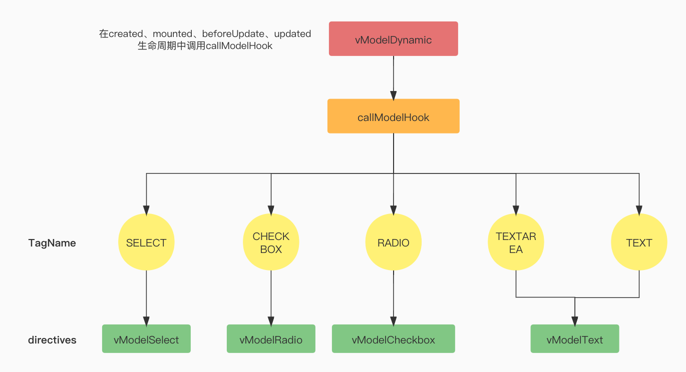

# 指令实现分析

## v-model

## v-bind

## v-on

## v-for

## v-if & v-else & v-else-if

## v-show

## v-slot

v-text

v-html

v-pre

v-cloak

v-once

v-memo

v-is

相较于vue2中的指令实现，Vue3经过更改之后更易理解。

生命周期

- **created** - 新增！在元素的 attribute 或事件监听器被应用之前调用。
- bind → **beforeMount**
- inserted → **mounted**
- **beforeUpdate**：新增！在元素本身被更新之前调用，与组件的生命周期钩子十分相似。
- update → 移除！该钩子与 `updated` 有太多相似之处，因此它是多余的。请改用 `updated`。
- componentUpdated → **updated**
- **beforeUnmount**：新增！与组件的生命周期钩子类似，它将在元素被卸载之前调用。
- unbind -> **unmounted**

调用

invokeDirectiveHook 负责调用指令钩子

执行

在任务调度器中的三个阶段执行

